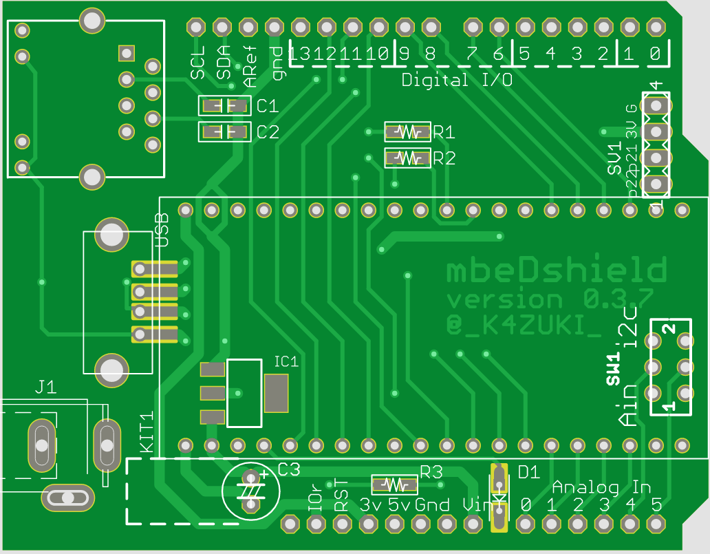
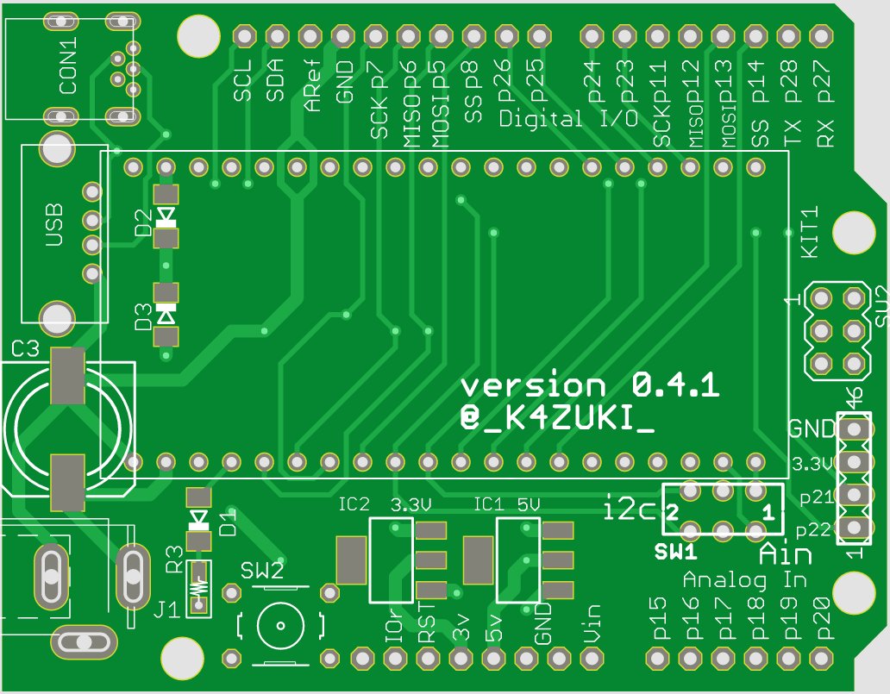
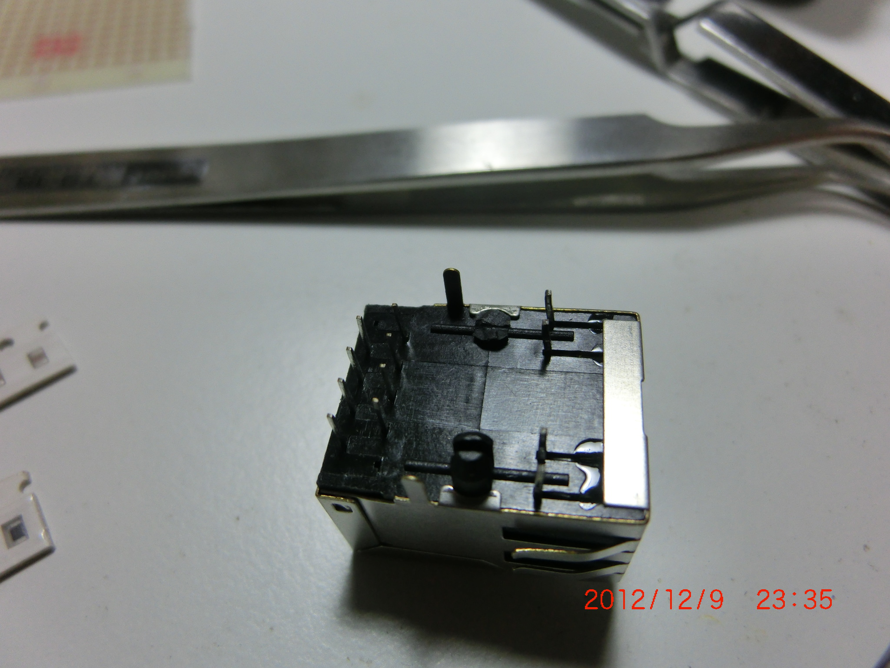

<!-- align right
- **31/Dec/2015 rev3.0 (C89)**
- 31/Dec/2014 rev2.0 (C87)
- 31/Dec/2013 rev1.0 (C85)
-->

<!-- toc
# Contents{.unnumbered}
1. _**Version history**_
2. _**Components**_
3. _**Soldering of the Kit**_
4. _**Software**_
5. _**Schematics of v0.5.0**_
6. _**Revision history**_
-->
\newpage
# まえがき：そもそもなぜ作ろうと思ったのか
私が最初のプロトタイプを作ろうと思い立ったのは2011年のことでした。  
当時すでにArduinoは流行りだしていましたが、IDEのバージョンでコンパイル通らなかったりする不安定さ^[未だにグダグダやってますね(ニッコリ)]に
嫌気が差して、と言うかほとんど食わず嫌いで触らずにいました。AVRマイコンそのものでは遊んでいたんですが。  
そこにARMマイコンを搭載したmbed^[ここではいわゆる青mbedを指します] が登場したので、以前にもCQ出版のInterface誌の付録のARMマイコンに
手を出していたこともあり、すぐに^[といってもmbed登場が2010年とかなので1年位遅れて]食いつきました。  
しかしながら、電子工作といったらArduino!みたいになってるし、シールド乱発してるし、だからって
mbedをブレッドボードでどうこうするのは嫌だな〜とか、Arduino用のケースなるものまで登場してるじゃないか！
みたいになって、乗るしかない、このビッグウェーブに！状態になりました。  
実際にプロトタイプを考えるにあたって、mbedがArduinoに比べて優れているところはEthernet
とUSBホストを使えるという点だったので、スイッチサイエンスで売っていたmbedのEthernetピンをブレボ上でRJ45に引き出しちゃうキットを
購入。購入した場所が千石電商だったので一緒に売っていたサンハヤトのユニバーサルArduinoシールドに実装することにしました。  
一番最初のmbeduino+Arduinoシールド作例をI2Cキャラクタ液晶で作り、その動作を確認するとすぐにEagleで
ボード設計にとりかかった_ような気がします_。  
そこから0.1.0 / 0.3.7^[作りすぎた] / 0.4.0^[作りすぎた] / 0.5.0^[あと1個売れ残ってるのなんなの] / 0.6.0と作ってきました。
しかしながら、お気づきのように、**未だ1.0.0になってません**。スミマセン。  
この本は、それらのバージョン遍歴とそれぞれに使用した部品の一覧、キットの作り方、作例へのポインタ、最新版の回路図で構成されています。

# _バージョン履歴_
## v0.0.1 = 手配線で作ったプロトタイプ
 

- サンハヤトのユニバーサルシールド"UB-ARD01"を使用
- スイッチサイエンスの
SSCI-MBED-ETHER-KIT^[https://www.switch-science.com/catalog/555/] を使用
    - ArduinoじゃEthernet無理やろ！的な
- mbed1768^[https://developer.mbed.org/platforms/mbed-LPC1768/] ^[https://www.switch-science.com/catalog/250/]
をメインに使用

\newpage

## v0.1.0 = "mbeduino"として設計された最初の基板
 

- アホなのでネーミング衝突の可能性についてググらなかった
    - 見事バッティングしてた
- 古いArduinoのピン配列
- リセットボタン未実装
- リセット信号の設計に問題あり
- Arduinoで採用されているM3のネジ穴を開けず0.8ミリのガイド穴だけ開けておいた
- USBホスト用コネクタを載せた
- DCジャックはスイッチサイエンスのブレッドボード用を使用

\newpage

## v0.3.7 = 2番めの設計リリース
 

- このバージョンから呼び名を"mbeDshield"に変更。Dは大文字
- USBミニBコネクタを裏面に配置しUSBホストとデバイスの両動作をサポート
- 後期(UNO以降)のArduinoピン配列
- A4/A5ピンはアナログ入力とI2Cをスイッチで切り替えられるようにした
- M3ネジ穴なし(忘れたorz)
- リセットスイッチ
- DCジャックの長穴指定がうまくいった

\newpage

## v0.4.0 = 3番めのリリース
 

- **ほぼすべての部品を秋月電子から購入可能にした**
- 裏面配置の部品なし
- 設計ミスで通常の電解コンデンサを使うとUSBケーブルと干渉する
    - キットには低背品が入ってます
- _ついに_ M3ネジ穴を実装
    - RJ45と干渉します
- 両面シルク

\newpage

## v0.4.1 = 4番目のリリース候補その1
 

- **データだけ作った**
- **イーサネット用RJ45コネクタを削除**
- 1ミリ幅のグランド配線
- 後部(図では右側)にSPI用の2x3ピンヘッダのランドを用意
- 両面シルク
- 3.3V系と5V系に専用レギュレータを設置；それぞれ容量0.5Aまで
    - 7〜9Vの外部電源が必要

\newpage

## v0.4.2 = 4番目のリリース候補その2
 

- **データだけ作った**
- Vinとグランドをベタに
- 3.3V系と5V系に専用レギュレータを設置；それぞれ容量0.5Aまで
    - 7〜9Vの外部電源が必要
- USBホスト動作はオンボードのレギュレータからVBUS電源を供給
- 入力(電解)コンデンサを表面実装タイプに変更
- 後部(図では右側)にSPI用の2x3ピンヘッダのランドを用意
- ~~スイッチサイエンスか秋月に販売委託するかも？~~ - 実現せず

\newpage

## v0.5.0 = 4番目の正式リリース
 

- スイッチサイエンスで委託販売開始
^[https://www.switch-science.com/catalog/1717/]
    - 最後の1個がしぶとく売れ残っている（けど廃番）
- USBホスト機能はmbed本体のUSBコネクタにケーブルが接続されている時だけ動作
    - LPC1768でのみ動作
- USBデバイス機能はバスパワー不使用
- ArduinoのI^2^C専用ピンは1768のみ使用可能（設計ミス）

\newpage

## v0.6.0 = released 5th PCB design
 

- USBホスト動作のための専用レギュレータ復活
- I^2^Cピンに使用するmbedのピンをp27/28からp9/10に変更
- スイッチサイエンスに委託販売交渉中
    - *みんなのラボ^[http://wakanyan.net/] ブランドとして*

\newpage

# 使用部品リスト
| No. | 内容                                       | 秋月通販番号 | 0.1.0 | 0.3.7 | 0.4.0 | 0.4.1 | 0.4.2 | 0.5.0 | 0.6.0 |
|:----|:-------------------------------------------|:-------------|:-----:|:-----:|:-----:|:-----:|:-----:|:-----:|:-----:|
| 1   | 20ピン ピンソケット（2個）                 | C-3138       |   v   |   v   |   v   |   v   |   v   |   v   |   v   |
| 2   | 8ピン ピンソケット（4個）                  | C-4046       |   v   |   v   |   v   |   v   |   v   |   v   |   v   |
| 3   | 6ピン ピンソケット（2個）                  | C-4045       |   v   |   v   |   v   |   v   |   v   |   v   |   v   |
| 4   | 10ピン ピンソケット（追加2個）             | C-7199       |   -   |   v   |   v   |   v   |   v   |   v   |   v   |
| 5   | 6ピン ピンソケット（追加2個）              | (C-4045)     |   v   |   -   |   -   |   -   |   -   |   -   |   -   |
| 6   | 表面実装 USB Aメスコネクタ                 | -            |   v   |   -   |   -   |   -   |   -   |   -   |   -   |
| 7   | スルーホール USB Aメスコネクタ             | C-160        |   -   |   v   |   v   |   v   |   v   |   v   |   v   |
| 8   | 表面実装 USB ミニBメスコネクタ             | C-5843       |   v   |   -   |   -   |   -   |   -   |   -   |   -   |
| 9   | スルーホール USB ミニBメスコネクタ         | C-2235       |   -   |   v   |   v   |   v   |   v   |   v   |   v   |
| 10  | DCジャック                                 | C-6568       |   -   |   v   |   v   |   v   |   v   |   v   |   v   |
| 11  | 表面実装 5Vレギュレータ                    | I-2503       |   v   |   v   |   v   |   v   |   v   |   v   |   v   |
| 12  | 表面実装 3.3Vレギュレータ                  | I-2502       |   -   |   -   |   -   |   v   |   v   |   v   |   v   |
| 13  | 2012サイズ 表面実装 0.1uFセラコン          | P-355        |   v   |   v   |   v   |   v   |   v   |   v   |   v   |
| 14  | 表面実装 100オーム抵抗器                   | R-6101       |   v   |   v   |   v   |   v   |   v   |   v   |   v   |
| 15  | 表面実装 ショットキーダイオード            | I-2073       |   v   |   v   |   v   |   v   |   v   |   v   |   v   |
| 16  | 2回路2接点スライドスイッチ                 | P-2627       |   v   |   v   |   v   |   v   |   v   |   v   |   v   |
| 17  | スルーホール 電解コンデンサ 100uF/16V      | P-5002       |   v   |   v   |   v   |   -   |   -   |   v   |   v   |
| 18  | スイッチサイエンスで売っているRJ45コネクタ | -            |   v   |   v   |   -   |   -   |   -   |   -   |   -   |
| 19  | 秋月のRJ45コネクタ                         | P-4809       |   -   |   -   |   v   |   -   |   -   |   -   |   -   |
| 20  | タクトスイッチ                             | P-3647       |   -   |   -   |   v   |   v   |   v   |   v   |   v   |
| 21  | 表面実装 電解コンデンサ 330uF/25V          | P-6978       |   -   |   -   |   -   |   v   |   v   |   -   |   -   |
| 22  | 2x3ピン 背が高いピンヘッダ                 | -            |   -   |   -   |   -   |   v   |   v   |   v   |   v   |

\newpage

# _キットのハンダ付け手順_
背が低い部品から順に取り付けます。
From lower height components:

1. 表面実装部品^[0.6.0ではリフロー実装済]
1. mbedのソケット
1. 電解コンデンサ
1. USB AメスとミニBメスコネクタ
1. DCジャック
1. シールド類をスタックさせるために長足ピンソケットを改造したあと取り付け^[0.6.0ではこの部分不要]
    - それぞれのペアの片方からピンをぜんぶ抜き取る
    - もう片方（まだ足がある方）を上から挿す
    - 2個重なった状態でハンダ付け
1. イーサネット用RJ45コネクタ^[0.5.0以降はこの部分不要]

 

 

\newpage

# _ソフトウェア対応_
mbed用の各種ソフトを使うことができます。筆者の経験では...

## 0.4.0以前の基板とLPC1768の組み合わせのとき{.unnumbered}
- LPC1768のオンボードイーサネット機能とNTPクライアント
- LPC1768のオンチップUSBホスト機能を使ってBluetoothドングル越しにWiiリモコンからの入力を処理

## すべてのバージョンについて{.unnumbered}
- Seeed Sturioの2.8インチ液晶シールド^[https://www.switch-science.com/catalog/1173/]
- スイッチサイエンスで販売中の@hayasita氏作VFD時計シールド^[https://www.switch-science.com/catalog/1954/]
- Sparkfun製タッチシールド（MPR121を使用）^[https://www.switch-science.com/catalog/1966/]
- 秋月電子で販売中のSPI制御のメモリ液晶（シールドを自作する必要があります）
    - マルツエレックでブレークアウトボードが販売されています^[http://www.marutsu.co.jp/pc/i/259032/] (2015~)
- 秋月電子で販売中のI^2^C接続16文字2行キャラクタ液晶^[http://akizukidenshi.com/catalog/g/gP-05693/]
- 秋月電子で販売中のAquestalk Pico^[http://akizukidenshi.com/catalog/g/gI-06220/ 代表の「ゆっくり」版]
- スイッチサイエンスで販売中のeVY1シールド^[https://www.switch-science.com/catalog/1489/]

## 確認中{.unnumbered}
- ~~スイッチサイエンスで販売中のイーサネットシールドR3~~ **廃番**
- スイッチサイエンスで販売中のArduino謹製USBホストシールド^[https://www.switch-science.com/catalog/1933/]
- スイッチサイエンスで販売中のSparkfun製Xbeeシールド^[https://www.switch-science.com/catalog/1972/]
- ~~スイッチサイエンスで販売中のGameduino~~ **廃番**

\newpage
# バージョン0.6.0回路図

\newpage
# 編集履歴
## リビジョン1.0: C85（2013年）{.unnumbered}
- 0.4.2まで記述

## リビジョン2.0: C87（2014年）{.unnumbered}
- 1.0からの改変/訂正/差替
- 0.6.0(の構想)まで記述

## リビジョン3.0: C89（2015年）{.unnumbered}
- 2.0の内容を訂正してMarkdown記法に移植
    - Pandocを用いてdocxファイルに変換

## リビジョン4.0: C90（2016年（予定））{.unnumbered}
- 3.0の内容を日本語に翻訳（ちょーめんどくさーい）

|  mbeDshield: もうひとつのmbed   |
|:-------------------------------:|
|         Kazuki Yamamoto         |
|           @\_K4ZUKI\_           |
| Revision 3.0 / C89 / 2015-12-31 |
