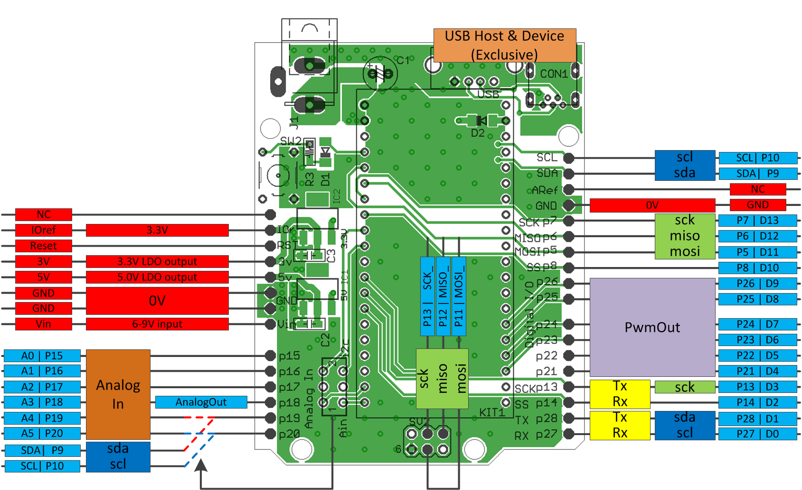

<!-- align right
- **31/Dec/2015 rev3.0 (C89)**
- 31/Dec/2014 rev2.0 (C87)
- 31/Dec/2013 rev1.0 (C85)
-->

<!-- toc
# Contents{.unnumbered}
1. _**Version history**_
2. _**Components**_
3. _**Soldering of the Kit**_
4. _**Software**_
5. _**Schematics of v0.5.0**_
6. _**Revision history**_
-->
\newpage

# _Version history_
## v0.0.1 = hand-wired prototype
 

- Sunhayato's universal shield UB-ARD01
- Switch Science(SSCI)'s SSCI-MBED-ETHER-KIT^[https://www.switch-science.com/catalog/555/]
- mbed LPC1768^[https://developer.mbed.org/platforms/mbed-LPC1768/] ^[https://www.switch-science.com/catalog/250/]

\newpage

## v0.1.0 = first PCB design as "mbeduino"
 

- the name already exist but didn't ask to Mr. Google
- old Arduino pin-out
- no reset button
- some mistake on reset signal line
- no M3 screw mounting hole but 0.8mm guide hole instead
- USB host supported

\newpage

## v0.3.7 = second PCB design release
 

- from this version it is named "mbeDshield", D is large character
- USB host and device supported(mini-B USB on bottom side)
- later Arduino pin-out
- A4/A5 pins are multiplexed of analog input or I2C-IO
- no M3 mounting screw hole(FORGOT to add XO)
- no reset switch

\newpage

## v0.4.0 = third PCB design release
 

- **most of components can be bought from AKIZUKI**
- all components on top side
- design bug on Vin capacitor with normal-height(cheap) one (kit uses low height one!)
- M3 mounting hole implemented finally
- silkscreen on Both sides

\newpage

## v0.4.1 = 4th PCB design rc1
 

- **only data exists**
- **no RJ45 socket**
- 1mm(40mil)line ground
- tail 2x3p pin headers for SPI (p5-8 shared)
- silkscreen on Both sides
- local LDOs on 3V and 5V lines, 0.5A each
- 7-9V input is necessary

\newpage

## v0.4.2 = 4th PCB design rc2
 

- **only data exists**
- split plane ground and Vin
- local LDOs on 3V and 5V lines, 0.5A each
- USB host is powered from mbed on-board LDO
- SMD Vin capacitor
- tail 2x3p high-height pin headers for SPI
- ~~ask SSCI or AKIZUKI for selling??? - maybe after prototype~~

\newpage

## v0.5.0 = released 4th PCB design
 

- sales available from SSCI^[https://www.switch-science.com/catalog/1717/]
- only **1** pcs left(as of 31/Dec/2015) and _discontinued_
- USB host is available only if main USB is connected(LPC1768 only)
- USB device mode only uses data lines(cannot get power from host)
- Arduino I^2^C pins are only available with 1768(known bug)

\newpage

## v0.6.0 = released 5th PCB design
 

- local LDO for USB host
- I^2^C pin-out change: p27/28 → p9/10
- asking SSCI for selling(under negotiation)
- *MinLab^[http://wakanyan.net/] brand*

\newpage

# _Components_
| No. | Description                  | AKIZUKI number | 0.1.0 | 0.3.7 | 0.4.0 | 0.4.1 | 0.4.2 | 0.5.0 | 0.6.0 |
|:----|:-----------------------------|:---------------|:-----:|:-----:|:-----:|:-----:|:-----:|:-----:|:-----:|
| 1   | 2x 20p pin socket            | C-3138         |   v   |   v   |   v   |   v   |   v   |   v   |   v   |
| 2   | 4x 8p pin socket             | C-4046         |   v   |   v   |   v   |   v   |   v   |   v   |   v   |
| 3   | 2x 6p pin socket             | C-4045         |   v   |   v   |   v   |   v   |   v   |   v   |   v   |
| 4   | 2x 10p additional pin socket | C-7199         |   -   |   v   |   v   |   v   |   v   |   v   |   v   |
| 5   | 2x 6p additional pin socket  | (C-4045)       |   v   |   -   |   -   |   -   |   -   |   -   |   -   |
| 6   | smd USB-A                    | -              |   v   |   -   |   -   |   -   |   -   |   -   |   -   |
| 7   | TH USB-A                     | C-160          |   -   |   v   |   v   |   v   |   v   |   v   |   v   |
| 8   | smd USB mini-B               | C-5843         |   v   |   -   |   -   |   -   |   -   |   -   |   -   |
| 9   | TH USB mini-B                | C-2235         |   -   |   v   |   v   |   v   |   v   |   v   |   v   |
| 10  | DC jack                      | C-6568         |   -   |   v   |   v   |   v   |   v   |   v   |   v   |
| 11  | 5V SMD LDO                   | I-2503         |   v   |   v   |   v   |   v   |   v   |   v   |   v   |
| 12  | 3.3V SMD LDO                 | I-2502         |   -   |   -   |   -   |   v   |   v   |   v   |   v   |
| 13  | SMD 0.1uF 2012               | P-355          |   v   |   v   |   v   |   v   |   v   |   v   |   v   |
| 14  | SMD 100ohm                   | R-6101         |   v   |   v   |   v   |   v   |   v   |   v   |   v   |
| 15  | SMD Schottky diode           | I-2073         |   v   |   v   |   v   |   v   |   v   |   v   |   v   |
| 16  | I2C/Analog switch            | P-2627         |   v   |   v   |   v   |   v   |   v   |   v   |   v   |
| 17  | TH Vin 100uF/16V             | P-5002         |   v   |   v   |   v   |   -   |   -   |   v   |   v   |
| 18  | RJ45 connector from SSCI     | -              |   v   |   v   |   -   |   -   |   -   |   -   |   -   |
| 19  | RJ45 connector from AKIZUKI  | P-4809         |   -   |   -   |   v   |   -   |   -   |   -   |   -   |
| 20  | reset switch                 | P-3647         |   -   |   -   |   v   |   v   |   v   |   v   |   v   |
| 21  | SMD Vin 330uF/25V            | P-6978         |   -   |   -   |   -   |   v   |   v   |   -   |   -   |
| 22  | 2x3p high-height pin header  | -              |   -   |   -   |   -   |   v   |   v   |   v   |   v   |

\newpage

# _Soldering of the Kit_
From lower height components:

- SMD parts C,R,D,LDO
- mbed socket
- Vin capacitor
- USB sockets A and mini-B
- Vin capacitor
- DC jack
- board connectors(not applicable from 0.6.0)
    - unplug pins from one of each pair
    - stack with other one
    - solder stacked socket

 

\newpage
- Ethernet RJ45 socket(not applicable from 0.5.0)

 

\newpage

# _Software_
You can use any existing softwares for mbed. From writer's experience:

## using mbed LPC1768 and PCB version 0.4.0 or older{.unnumbered}
- onboard Ethernet + NTP client
- onchip USB host + Bluetooth dongle to communicate with Wiimote(a.k.a. Wii Rimokon)

## all versions{.unnumbered}
- 2.8 inch touch LCD shield from Seeed Studio^[https://www.switch-science.com/catalog/1173/]
- VFD clock shield^[https://www.switch-science.com/catalog/1954/] from SSCI/@hayasita
- Touch Shield(MPR121 used) from sparkfun^[https://www.switch-science.com/catalog/1966/]
- SPI memory LCD from AKIZUKI(need to make your own shield)
    - **breakout board is available from MARUTSU^[http://www.marutsu.co.jp/pc/i/259032/] (2015~)**
- I^2^C 16x2 character LCD from AKIZUKI^[http://akizukidenshi.com/catalog/g/gP-05693/]
- Aquestalk Pico from AKIZUKI^[http://akizukidenshi.com/catalog/g/gI-06220/]
- eVY1 shield from SSCI^[https://www.switch-science.com/catalog/1489/]

## UNDER CONFIRMATIONS:{.unnumbered}
- ~~Ethernet shield R3 from SSCI/Arduino team~~ **Discontinued**
- USB host shield from Arduino team^[https://www.switch-science.com/catalog/1933/]
- Xbee shield from sparkfun^[https://www.switch-science.com/catalog/1972/]
- ~~Gameduino from SSCI~~ **Discontinued**

\newpage
# Schematics of v0.6.0

\newpage
# Revision history
## Revision 1.0: released at C85(2013){.unnumbered}
- documented up to 0.4.2

## Revision 2.0: released at C87(2014){.unnumbered}
- modification/correction/replace from Revision 1.0
- documented up to 0.6.0

## Revision 3.0: released at C89(2015, planned){.unnumbered}
- porting to markdown by using Revision 2.0 document
- use pandoc to convert to docx

|  mbeDshield: YET ANOTHER MBED   |
|:-------------------------------:|
|         Kazuki Yamamoto         |
|           @\_K4ZUKI\_           |
| Revision 3.0 / C89 / 2015-12-31 |
